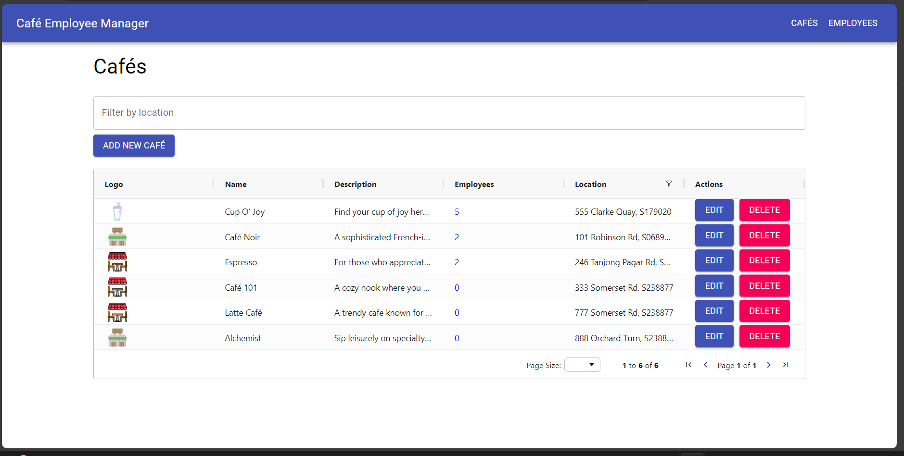
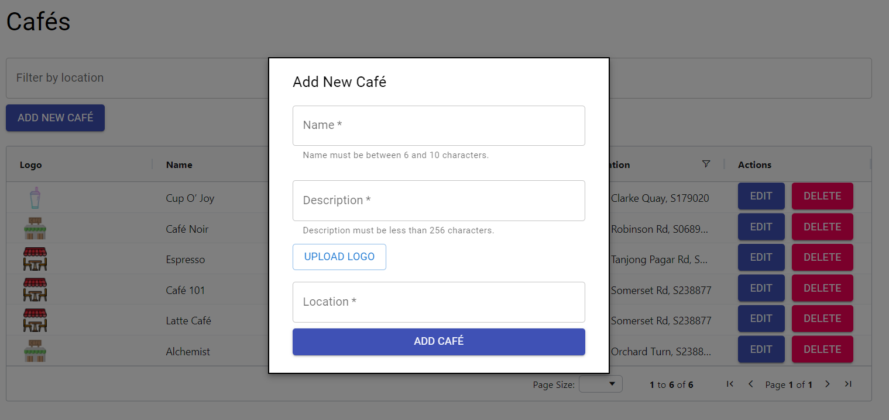
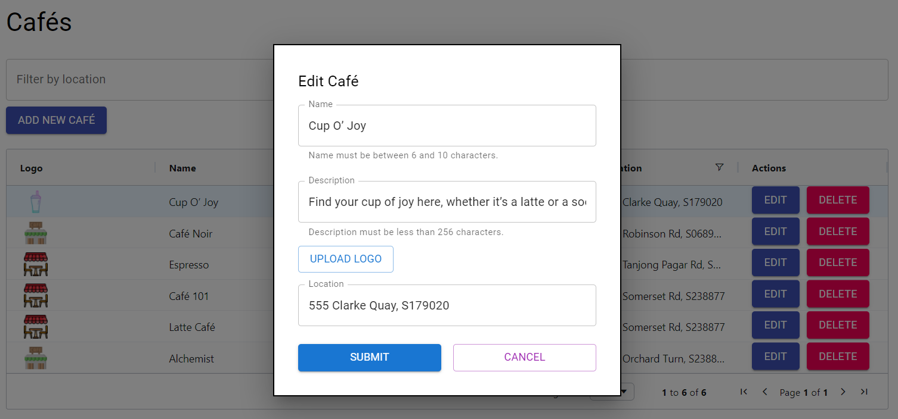
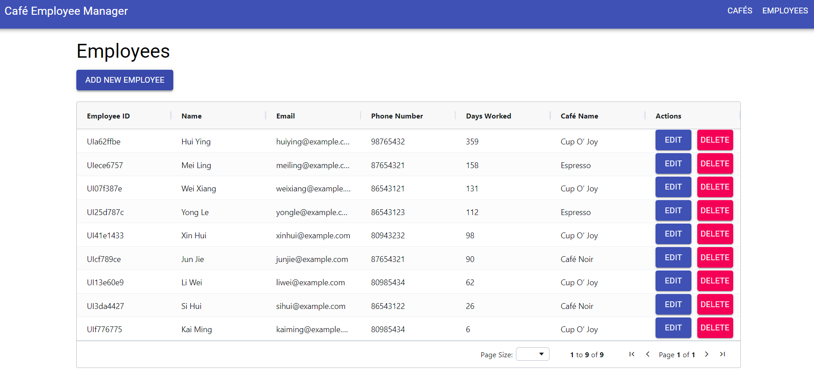
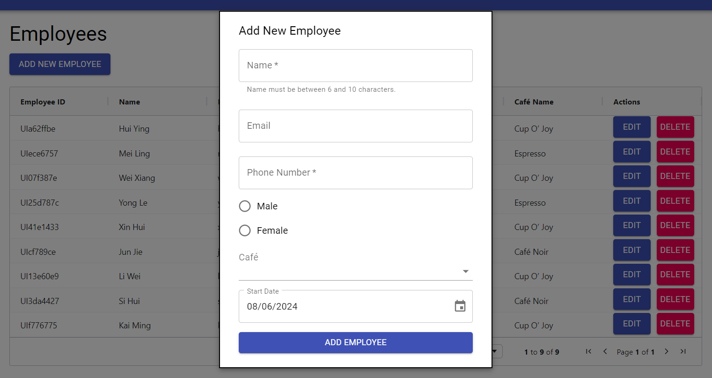
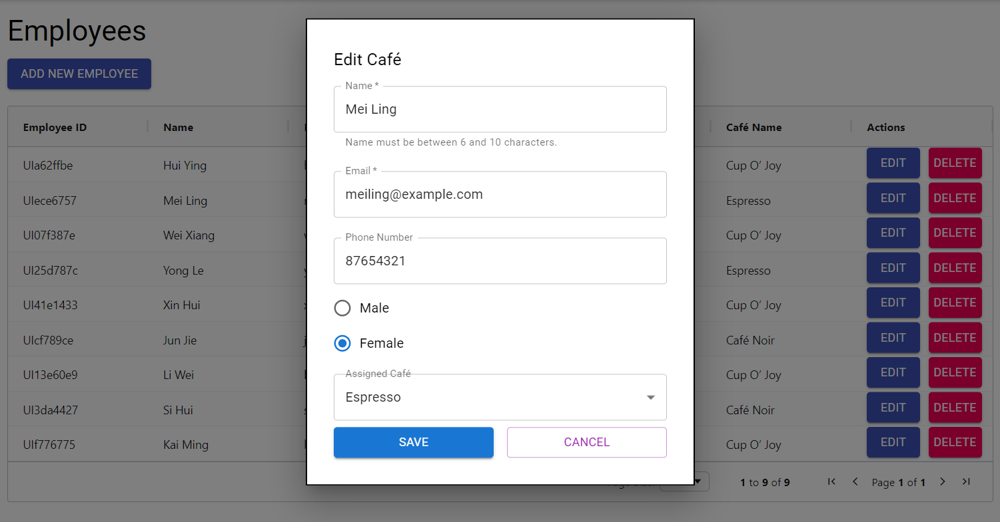

---
---

# Cafe Employee Management Application

## Overview

This is a full-stack application for managing cafes and their employees. The front-end is built with ReactJS, Redux, Redux-Saga, React Router, Material-UI, and AgGrid. The back-end is a .NET Core web API, and the database is MySQL.

## Prerequisites

Before you begin, ensure you have the following installed on your machine:

- Node.js (v20 or higher)
- Yarn (v1.22 or higher)
- .NET 8.0
- MySQL Server
- Visual Studio Code or any other preferred code editor

## Setup Instructions

### 1. Clone the Repository

```sh
git clone https://github.com/isajidh/cafe_management_system.git
cd cafe_management_system
```

### 2. Setting Up the MySQL Database

1. **Create a Database**:
   open this [script](./CafeEmployeeManager.DB/cafe%20management%20schema/cafe_employee_management_schema.sql)
   copy the content in it copy eveything.
   open a new query page in MYSQL
   paste in the text
   execute all

2. **Import the Database Schema and Data**:
   Use the provided `cafe_employee_management_schema.sql` file to set up the database schema and data:
   ```sh
   mysql -u root -p cafe_management_db < path/to/cafe_employee_management_schema.sql
   ```

### 3. Setting Up the .NET Core Web API

1. **Navigate to the API Directory**:

   ```sh
   cd CafeEmployeeManager.API
   ```

2. **Restore Dependencies**:

   ```sh
   dotnet restore
   ```

3. **Update Connection String**:
   Update the connection string in `appsettings.json` to match your MySQL database configuration:

   ```json
   "ConnectionStrings": {
     "DefaultConnection": "Server=localhost;Database=cafe_employee_management_db;User=root;Password=yourpassword;"
   }
   ```

4. **Run the API**:
   ```sh
   dotnet run
   ```

### 4. Setting Up the ReactJS Front-End

1. **Navigate to the React Application Directory**:

   ```sh
   cd ../CafeEmployeeManager.UI
   ```

2. **Install Dependencies**:

   ```sh
   yarn install
   ```

3. **Run the React Application**:
   ```sh
   yarn start
   ```

### 5. Running Tests

To run the unit tests for the React application:

```sh
yarn test
```

## Usage

- **Café Page**:

  - Lists all cafes.
  - Features include filtering by location, adding a new café, and editing/deleting cafes.
  - Clicking on the employees count navigates to the Employees page showing employees under that café.

- **Employee Page**:
  - Lists all employees.
  - Features include adding a new employee, and editing/deleting employees.

## Troubleshooting

- **Common Errors**:

  - **Database Connection**: Ensure your MySQL server is running and the connection string in `appsettings.json` is correct.
  - **API Not Running**: Ensure you have navigated to the API directory and run `dotnet run`.

- **Logs and Debugging**:
  - Check the terminal for any error messages and stack traces.
  - For database-related issues, check MySQL logs.

---

By following this README, you should be able to set up and run the Cafe Employee Manager application on your local machine. If you encounter any issues, please refer to the Troubleshooting section or reach out me in [Linkedin](https://www.linkedin.com/in/isajidh/) for support.

### 6. Screenshots








## How to run in the Docker environtment

## Prerequisites

Before you begin, ensure you have the following installed on your machine:

- [Docker](https://www.docker.com/get-started)
- [Docker Compose](https://docs.docker.com/compose/install/)

## Setup

### 1. Clone the Repository

```bash
git clone https://github.com/isajidh/cafe_management_system.git
cd cafe_management_system
```

### 2. Build and Run the Docker Containers

Navigate to the root directory of the project where the docker-compose.yml file is located and run:

```bash
docker-compose up --build
```

This will build and start the following services:

cafeemployeemanager.db: MySQL database
cafeemployeemanager.api: .NET Core web API
cafeemployeemanager.ui: ReactJS frontend

### 3. Access the Application

Once the containers are up and running, you can access the application at:

Frontend (UI): http://localhost:3000
API (Swagger): http://localhost:5000/swagger

### 4. Environment Variables

The API and frontend services are configured to communicate using environment variables defined in the docker-compose.yml file. Ensure these variables are correctly set for the application to function properly.

### Database Initialization

The MySQL database is initialized with the schema and data defined in the db service within the docker-compose.yml file. If you need to seed the database or apply migrations, ensure these scripts are included in the appropriate Dockerfile or entrypoint scripts.

## CORS Configuration

The application is configured to handle CORS appropriately for both development and production environments. Ensure the CORS policies are correctly set in the Program.cs file of the API project.

## Stopping the Application

To stop the application and remove the containers, run:

```bash
docker-compose down
```

This command stops and removes all the services defined in the docker-compose.yml file.

## Troubleshooting

### Common Issues

Ports Already in Use: Ensure that the ports required by the services (3000, 5000, and 3306) are not being used by other applications on your machine.
Database Initialization Errors: Ensure the MySQL environment variables (e.g., MYSQL_ROOT_PASSWORD) are correctly set and not conflicting.
For further assistance, refer to the Docker and Docker Compose documentation or open an issue in the repository.
